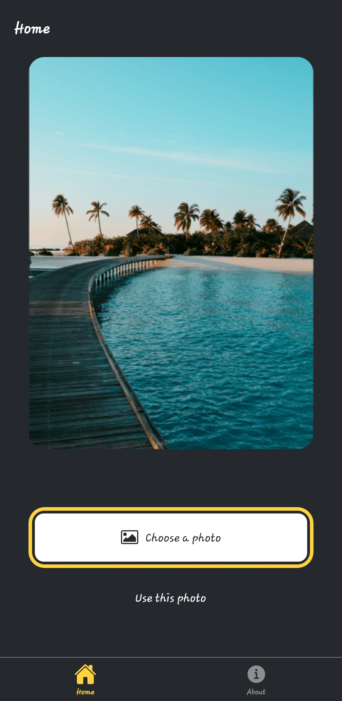
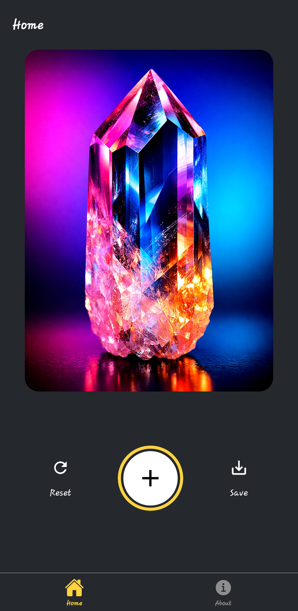
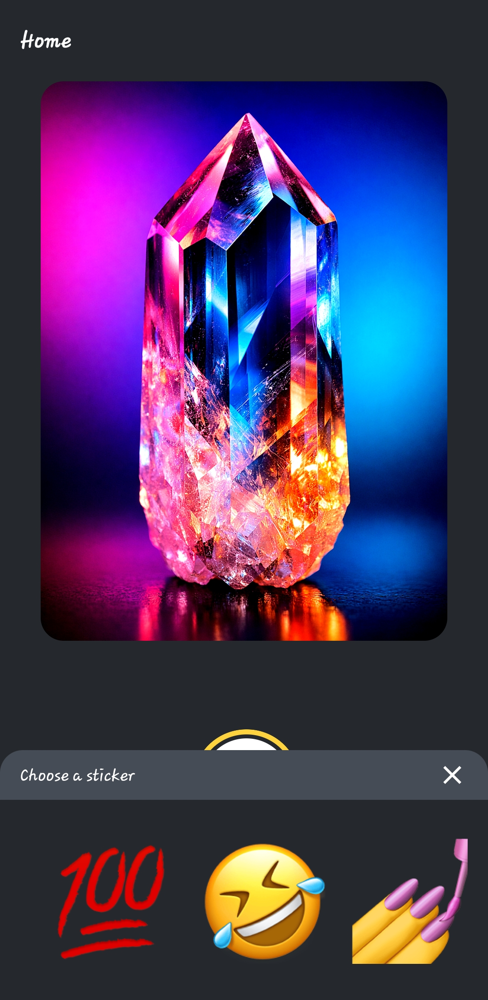
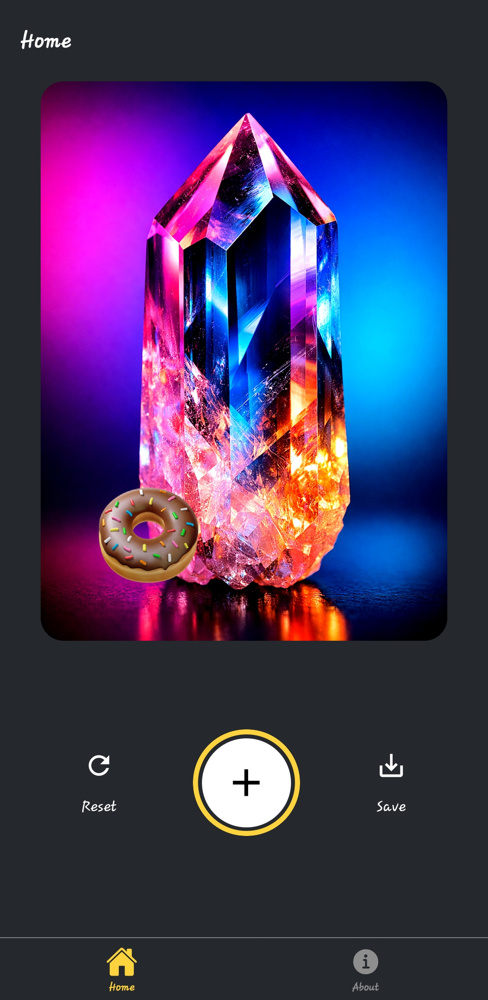
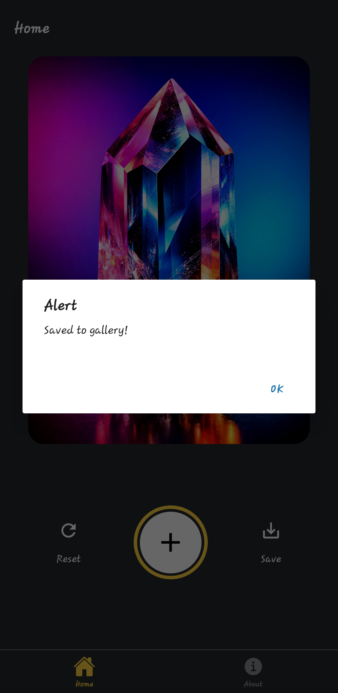
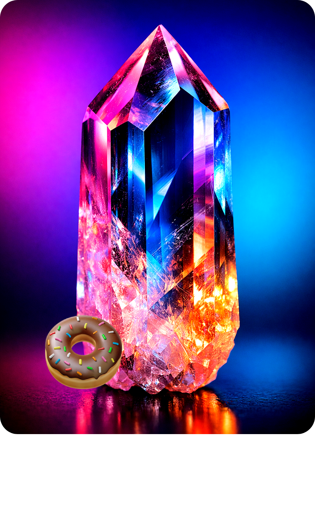

# StickerSmash

StickerSmash is a cross-platform mobile app built with React Native and Expo.
It lets users pick an image from the gallery, place emoji stickers on top, and save the final composition back to the device.

## Features

- Pick an image from device gallery
- Open a sticker picker and choose emoji stickers
- Place stickers on top of the selected image
- Reset edits with a single action
- Save final output to local gallery
- Works on Android, iOS, and Web (Expo)

## Tech Stack

- React Native
- Expo + Expo Router
- TypeScript
- expo-image-picker
- expo-media-library
- react-native-view-shot
- react-native-gesture-handler

## Getting Started

### Prerequisites

- Node.js (LTS recommended)
- npm
- Expo Go app (optional for device preview)

### Installation

```bash
npm install
```

### Run the App

```bash
npm run start
```

Platform specific:

```bash
npm run android
npm run ios
npm run web
```

## Lint

```bash
npm run lint
```

## Screenshots

<p align="center">
  
  
  
  
  
  
</p>
